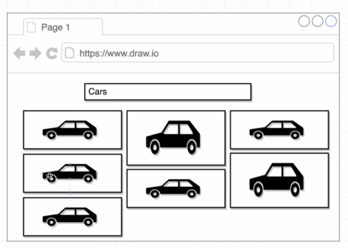

### Introduction to V2 Implementation

In this project the functionalities of the existing v1 (could be found in a seperate branch) is enhanced to render the images in a more functional way- through a grid layout.  

Kind of like in this way:

