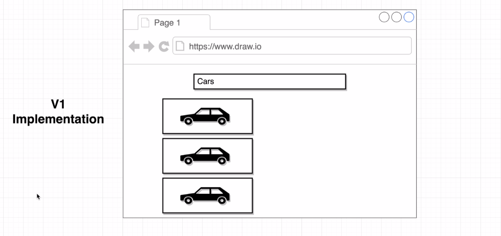

In this project basic react functionalities are used to create an application which will somewhat be able to interact with user input.  

Here, there would basically be a search bar, where the user can input the values like "car", "plants", "buildings" etc. and as an output the application would be hitting an external api, collecting the relevant images of the input field and showing them on the screen on a vertical manner.

