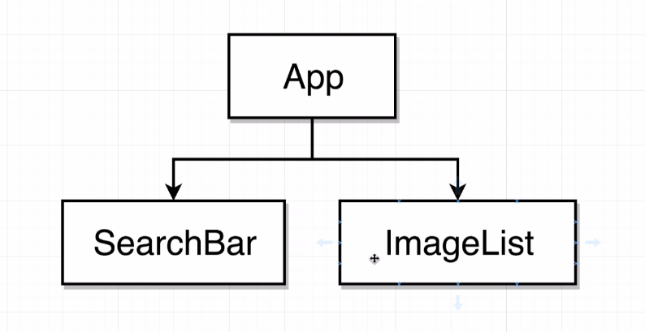

In this project basic react functionalities are used to create an application which will somewhat be able to interact with user input.  

Here, there would basically be a search bar, where the user can input the values like "car", "plants", "buildings" etc. and as an output the application would be hitting an external api, collecting the relevant images of the input field and showing them on the screen on a vertical manner.

 

#### Structure of the Project

The basic approach/structure of the project is somewhat as follows:

 
Here we will have two child components under the main "App" parent component.  
The first one- SearchBar would be for querying our external API for a list of images.  
The second one- ImageList would be for rendering/displaying the resultant images on the main page.
